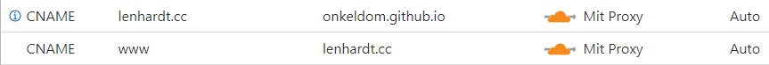
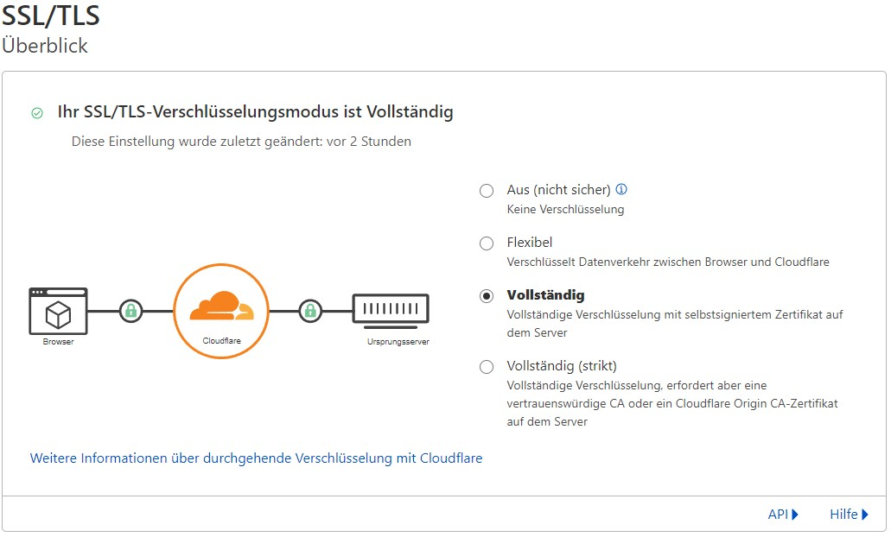
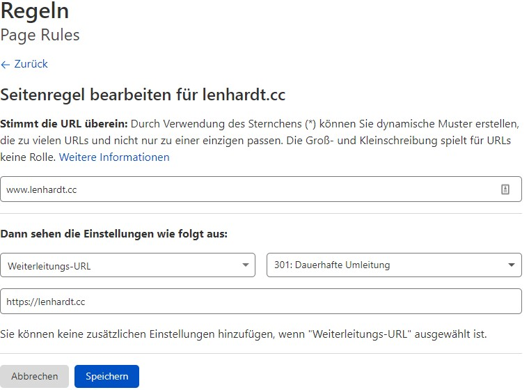

Bis heute hatte ich einen kleinen Server zum Weiterleiten meiner eigenen Domain auf die Github Page wo meine eigentliche Webseite liegt und meinen eigenen Mailserver. Da Cloudflare allerdings mittlerweile selbst Domains und div. Services dafür anbietet, konnte ich jetzt alles direkt mit Cloudflare lösen. Hier findet ihr das komplette HowTo aus dem [Cloudflare Blog](https://blog.cloudflare.com/secure-and-fast-github-pages-with-cloudflare/) im Original.

* Reverse Proxy für meine Github Page
* Mail Weiterleitungen zum Schutz meiner eigentlichen Adressen
* Sonstige netten Cloudflare Sicherheitsdienste

In diesem Beitrag erkläre ich euch, wie ihr für eure Domain direkt über Cloudflare den Reverse Proxy für www und nicht www Adressen einrichtet, ohne den SSL Fehler wegen der Zertifikate zu bekommen.

# Was benötigt ihr hierfür?
* Eine Domain die bei [Cloudflare](https://www.cloudflare.com/) verwaltet wird
* Eine [Github Page](https://pages.github.com/)

# Einrichtung

## Github Page

Damit das Ganze auf der Github Page funktioniert, benötigt ihr im Root-Ordner eures Repositorie eine Datei mit der Domain, über die ihr erreichbar sein wollt.

Da ich persönlich das `www.` vor einer Domain hasse, habe ich einen Redirect von www. zu non-www einrichtet. Das bedeutet, dass ich in der folgenden Datei namens `CNAME` den Domainnamen `lenhardt.cc` ohne `www.` hinterlege

```bash
echo "lenhardt.cc" | tee ./CNAME
```

Das Ganze dann im Repositorie einchecken und pushen.

```bash
git commit -am "add CNAME file for external domain"
git push
```

Damit habt ihr auf der Github Seite schon mal die erforderlichen Voraussetzungen eingerichtet.

## Cloudflare DNS

Ihr müsst jetzt in den DNS-Einstellungen für eure Domain zwei CNAMES anlegen. 



In meinem Fall habe ich für meine Hauptdomain ohne `www.` einen CNAME auf `onkeldom.github.io` eingerichtet. Dort liegt meine Webseite. Der zweite CNAME wird für den Aufruf meiner Webseite mit `www.` benötigt. Also der Aufruf `www.lenhardt.cc` wird umgeleitet auf `lenhardt.cc`. Das kann man auch andersherum machen.

## Cloudflare SSL/TLS Konfiguration

Die SSL-Einstellungen müssen auf `Full SSL/Vollständig` eingestellt werden. Strikt kann hier nicht verwenden, da Cloudflare das Zertifikat von Github nicht hat.



## Cloudflare Regeln (Page Rules) Konfiguration

Damit jetzt noch die Umleitung von `www.` auf `non-www` oder andersherum funktioniert, ist noch eine Page Rule erforderlich.



Wenn ihr das ganze von `non-www` auf `www.` haben möchtet, müsst ihr das entsprechend andersrum hier eintragen.

Das wars auch schon. Jetzt ist eure Github Page über Cloudflare erreichbar und wird auch noch gleich geschützt.

## Cloudflare Cache

Wenn ihr an der Webseite Änderungen vorgenommen habt und diese nicht direkt sehen könnt, Lehrt auf der Übersichtsseite oben rechts einmal den Cache ;)